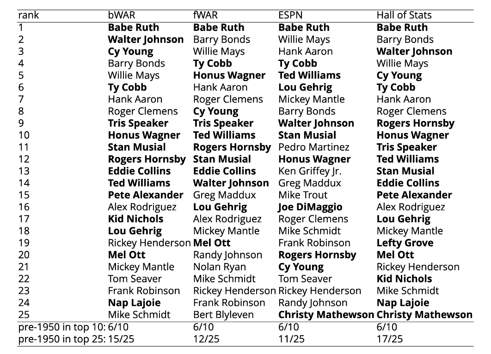
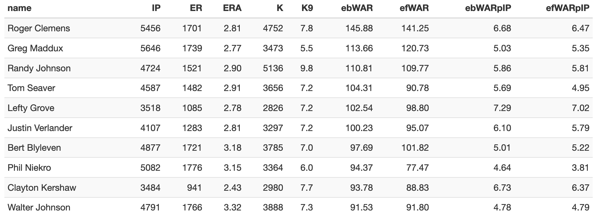

\newcommand{\R}{\mathbb{R}}
\newcommand{\Prob}{\mathbb{P}}
\newcommand{\Proj}{\textbf{P}}
\newcommand{\Hcal}{\mathcal{H}}
\newcommand{\rootn}{\sqrt{n}}
\newcommand{\p}{\mathbf{p}}
\newcommand{\E}{\text{E}}
\newcommand{\Var}{\text{Var}}
\newcommand{\Cov}{\text{Cov}}
\newcommand{\mubf}{\bm{\mu}}
\newcommand{\logit}{\text{logit}}

\newtheorem{cor}{Corollary}
\newtheorem{lem}{Lemma}
\newtheorem{thm}{Theorem}
\newtheorem{defn}{Definition}
\newtheorem{prop}{Proposition}


```{r setup, include=FALSE, warning=FALSE, message=FALSE}
knitr::opts_chunk$set(echo = TRUE,tidy.opts=list(width.cutoff=40))
library(ggplot2)

mycols     = c("chartreuse3", "orangered", "deepskyblue3", "darkorchid1", "yellow")
dark_theme = theme(plot.background   = element_blank(), 
                   panel.background  = element_blank(),
                   #legend.background = element_blank(), legend.key = element_blank(),
                   axis.title.x      = element_text(size = 26, colour = "grey80",
                                                    margin=margin(10,0,0,0)),
                   axis.title.y      = element_text(size = 26, colour = "grey80",
                                                    margin=margin(0,20,0,0)),
                   axis.text         = element_text(size=18, color = "grey80"), 
                   text              = element_text(size=20),
                   axis.title        = element_text(size = 26),
                   legend.title      = element_text(size = 26, colour = "grey80"),
                   panel.border      = element_blank(),
                   panel.grid.major  = element_line(colour = "grey50"), 
                   panel.grid.minor  = element_line(colour = "grey30"))
```


## Background

The first box score appeared in 1859.

\vspace{12pt}
Major League Baseball is, and always has been, a game dominated by statistics. 

\vspace{12pt}
These statistics can be used to compare the performances of players.

\vspace{12pt}
However, as will be made clear, baseball statistics are not suitable for cross-era comparisons of players.

\vspace{12pt}
We will attempt the rectify this issue and construct suitable statistics that can be used to compare players across eras.

##


## 





## 


Results are summarised [here](https://deck13.shinyapps.io/challenging_baseball_nostalgia/).

## 


## 


## 

\begin{center}
So what is going on here!?
\end{center}


## Enter [Stephen Jay Gould](https://en.wikipedia.org/wiki/Stephen_Jay_Gould)

 

In his 1996 book "[Full House: The Spread of Excellence from Plato to Darwin](https://en.wikipedia.org/wiki/Full_House:_The_Spread_of_Excellence_from_Plato_to_Darwin)," Gould argued that there is a right wall of human excellence and that the greatest players stood right against that wall. He said that as time has gone on, the average MLB player has approached that wall.

\vspace{12pt}
He also said that baseball is balance between hitting and pitching, and the balance has been preserved as both have gotten better.

\vspace{12pt}
The variation in success has shrunk as time has gone on.

\vspace{12pt}
It is therefore hard for the modern great players to stand out above their peers to the same degree as the old time players.

\vspace{12pt}
These dynamics have proven quite challenging to existing statistical models.

##


## Introducing the Full House Model

Our methodology is a crystallization of the conceptual ideas put forward by evolutionary Stephen Jay Gould.

\vspace{12pt}
We name our model the Full House Model in his honor.


## Structure

We will suppose the following structure:

- There are seasons indexed by $i$.
- Each season has $n_i$ active MLB players.
- These active MLB players are a part of a population of $N_i > n_i$ potential eligible MLB players.

\vspace{12pt}
We further suppose that:

- Every potential eligible MLB players in the population has a iid latent talent $X_{i,1},\ldots,X_{i,N_i} \sim F_{X}$.
- We know the MLB inclusion mechanism $g_i(X_{i,j}, \textbf{X}_{i,-j})$ for each season $i$ and each active MLB player $j = 1,\ldots,N_i$.
- We have observed $Y_{i,1},\ldots,Y_{i,n_i} \sim F_{Y_i}$.


## Structure

Each season $i$ is comprised of active MLB players with the highest latent talent.
We specify that
$$
  g_i(X_{i,j}, \textbf{X}_{i,-j}) = 1(X_{i,j} \geq X_{i,(N_i-n_i+1)}).
$$


\vspace{12pt}
We will further assume that latent talent and observed values exhibit a 1-1 relationship, i.e. we can form pairs
$$
  \left(Y_{i,(j)}, X_{i,(N_i-n_i+j)}\right).
$$

## Estimating talent (parametric)

We will estimate talent scores from the observed values Y using order statistic results and the probability integral transformation

$$
\begin{aligned}
F_{Y_i}\left(Y_{i,(j)} \mid \theta_i\right) & \sim U_{i,(j)}, & & F_{Y_i}\left(Y_{i,(j)} \mid \hat{\theta_i}\right) \approx U_{i,(j)}, \\
\end{aligned}
$$
where $U_{i,j} \sim U(0,1)$, and $U_{i,(j)} \sim \operatorname{Beta}(j, n_i+1-j)$.

\vspace{12pt}
Our setup and these results permit us to estimate $X$ as
$$
X_{i, (N_i-n_i+j)} = F_{X_{i, (N_i-n_i+j)}}^{-1}\left(F_{U_{i,(j)}}\left(F_{Y_{i}}\left(Y_{i,(j)} \mid \hat{\theta}_i\right)\right)\right) .
$$

\vspace{12pt}
Talent is pegged to performance. The talent score is a quantile function evaluated at a probability value given by performance vs one's peers.


## Estimating cross-contextual statistics (parametric)

Let $l_{i, j}$ be the rank of $X_{i,\left(N_{i}-n_{i}+j\right)}$ among the values
$$
\left\{X_{i,\left(N_{i}-n_{i}+j\right)}, X_{i^{\prime},\left(N_{i^{\prime}}-n_{i^{\prime}}+k\right)}: k=1, \ldots, n_{i^{\prime}}\right\} .
$$

\vspace{12pt}
We can now reverse engineer the process on the previous slide.

\vspace{12pt}	
We compute $Y_{i, j, i^{\prime}}$, which is the statistic in system $i^{\prime}$ corresponding to a component with talent score $X_{i,\left(N_{i}-n_{i}+j\right)}$.
	
<!-- \vspace{12pt} -->
<!-- Then -->
<!-- $$ -->
<!-- Y_{i, j, i^{\prime}}=F_{Y_{i^{\prime}}}^{-1}\left(F_{U_{\left(l_{i, j}\right)}}^{-1}\left(F_{X_{i^{\prime},\left(N_{i^{\prime}}-n_{i^{\prime}}+I_{i, j}\right)}}\left(X_{i,\left(N_{i}-n_{i}+j\right)}\right)\right) \mid \hat{\theta}_{i^{\prime}} \right). -->
<!-- $$ -->


<!-- ## Schematic illustration -->

<!--  -->


<!-- ## Nonparametric estimation of $F_{Y_{i}}$ -->

<!-- We motivate an interpolated CDF estimator $\widetilde{F}_{Y_i}$ which is constructed with surrogate points defined as: -->

<!-- $$ -->
<!-- \begin{aligned} \widetilde{Y}_{i,(1)} &=Y_{i,(1)}-Y_{i}^{*} \\ \widetilde{Y}_{i,(j)} &=\left(Y_{i,(j)}+Y_{i,(j-1)}\right) / 2, \quad j=2, \ldots, n \\ \widetilde{Y}_{i,\left(n_{i}+1\right)} &=Y_{i,\left(n_{i}\right)}+Y_{i}^{* *} \end{aligned} -->
<!-- $$ -->

<!-- \vspace{12pt} -->
<!-- $Y_{i}^{*}$ and $Y_{i}^{* *}$ are meant to handle extrapolation. With this construction, we build $\widetilde{F}_{Y_{i}}$ as -->
<!-- $\begin{aligned} \widetilde{F}_{Y_{i}}(t) &=\sum_{j=1}^{n_{i}}\left(\frac{j-1}{n_{i}}+\frac{t-\widetilde{Y}_{i,(j)}}{n_{i}\left(\widetilde{Y}_{i,(j+1)}-\widetilde{Y}_{i,(j)}\right)}\right) 1\left(\widetilde{Y}_{i,(j)} \leq t<\widetilde{Y}_{i,(j+1)}\right) \\ &+1\left(t \geq \widetilde{Y}_{i,\left(n_{i}+1\right)}\right) \end{aligned}$ -->


<!-- ## Estimation of the upper bound $Y_{i}^{**}$ -->

<!-- The $p$-quantile $y_{p}$ of $F_{Y_{i}}$ is defined as $y_{p}=\inf \left\{y: F_{Y_{i}}(y) \geq p\right\}$. -->

<!-- \vspace{12pt} -->
<!-- Suppose $p_{j, i, \gamma, n_{i}}$ is the value that satisfies $\gamma=P\left(Y_{i,(j)} \geq y_{p}\right)$. -->

<!-- \vspace{12pt} -->
<!-- [Hoaglin](https://www.wiley.com/en-us/Understanding+Robust+and+Exploratory+Data+Analysis-p-9780471384915) provided an approximation for $p_{j, i, \gamma, n_{i}}$ at $\gamma=0.5$ : -->

<!-- $$ -->
<!-- p_{j, i, .5, n_{i}} \approx \frac{j-\frac{1}{3}}{n_{i}+\frac{1}{3}} . -->
<!-- $$ -->


<!-- ## Estimation of the upper bound $Y_{i}^{* *}$ -->

<!-- Following [Scholz](http://faculty.washington.edu/fscholz/Reports/extrap.pdf), we consider the regression fit on points $(h(p_{i,j,.5,n_i}), Y_{i,(j)})$, $j = n_i - k + 1,\ldots,n_i$, where  -->

<!-- - $k$ is the number of extreme data values to use in the extrapolation step -->
<!-- - $h$ is a function of the percentiles. -->

<!-- \vspace{12pt} -->
<!-- The specific choices that we considered for $h$ are:  -->
<!-- \begin{itemize} -->
<!-- \item linear transformation: $h_{\theta}(p) = \theta_1 + \theta_2 p$; -->
<!-- \item logit transformation: $h_{\theta}(p)  = \theta_1 + \theta_2 \log(p/(1-p))$; -->
<!-- \item logit transformation with the quadratic term: $h_{\theta}(p)  = \theta_1 + \theta_2 \log(p/(1-p)) + \theta_3 \left[\log(p/(1-p))\right]^2$. -->
<!-- \end{itemize} -->


<!-- ## -->

<!-- \vspace{12pt}	 -->
<!-- Using this method we calculate: -->
<!-- $$Y_{i}^{* *}=\operatorname{argmin}_{y}\left|h^{-1}\left(Y_{i,\left(n_{i}\right)}\right)-\widetilde{F}_{Y_{i}, y}\left(Y_{i,\left(n_{i}\right)}\right)\right|$$ -->
<!-- where $\tilde{F}_{Y_{i}, y}$ is $\widetilde{F}_{Y_{i}}$ with a generic value $y$ replacing $Y_{i}^{* *}$. -->


<!-- \vspace{12pt} -->
<!-- Some notes:  -->

<!-- - The function $h$ is chosen based on adjusted $R^2$. -->
<!-- - The number of $k$ is calculated from [Scholz](http://faculty.washington.edu/fscholz/Reports/extrap.pdf) where we consider a larger $k$ in the presence of outliers. -->


## MLB eligible population

Baseball started as a game played by people largely from the Northeast (NE) region of the United States of America as indicated in [Berry and Schmidt (2005)](https://journals.sagepub.com/doi/10.1177/1527002504268613). 

Our construction of the MLB eligible population will be pegged to the population of age 20-29 males from the NE region of the United States of America. Simply stated, the MLB eligible population will be 
$$
  \frac{\text{NE and MW region population of age 20-29 males}}{\text{proportion of MLB players from NE and MW regions}} \times \text{adjustment}.
$$
Adjustments include the effects of: 

- changing interest in baseball 
- wars 
- segregation and gradual integration of the MLB
- globalization


## 


##


## 


##


##

We plot the estimated baseball-interested adjusted population from Latin American countries (solid red line) and the percentage of the MLB from these countries (blue line).


## Assumptions

Before we present results we discuss specific modeling choices and assumptions:

- $F_X \sim  \text{Pareto}(\alpha)$ with $\alpha = 1.16$. This choice of $\alpha$ reflects the Pareto Principle.
- All careers are evaluated in a common context constructed from non strike shortened NL seasons from 1977-1989. 


\vspace{12pt}
Additional baseball adjustments: 

- handedness-specific park factors
- smoothing results for individual players
- games played and innings pitched adjustments
- career trimming 


##

\begin{center}
Results
\end{center}


## 


```{r load_stuff, echo = FALSE, message = FALSE}
library(tidyverse)
library(knitr)
library(kableExtra)
library(Lahman)
#library(xtable)
bat_season <- read_csv("batters_adjusted_trim.csv") %>% 
  select(name, playerID, age, year, PA, AB, H, HR, BB, BA, OBP, HBP, SF, ebWAR, efWAR) %>% 
  mutate(ABpHR = round(AB/HR,2), 
         ebWARpPA = round(ebWAR/PA * 650, 2), 
         efWARpPA = round(efWAR/PA * 650, 2)) %>% 
  select(name, playerID, age, year, PA, AB, H, HR, BB, BA, OBP, ABpHR, HBP, SF, 
         ebWAR, efWAR, ebWARpPA, efWARpPA)
pit_season <- read_csv("pitchers_adjusted_trim.csv") %>%  
  mutate(K9 = round(K/IP * 9,1)) %>% 
  select(name, playerID, age, year, IP, ER, ERA, K, K9, ebWAR, efWAR) %>% 
  mutate(ebWAR = round(ebWAR, 2), efWAR = round(efWAR, 2), 
         ebWARpIP = round(ebWAR/IP * 250, 2), 
         efWARpIP = round(efWAR/IP * 250, 2))
bat_career <- read_csv("career_batters_trim.csv") %>% 
  dplyr::select(name, playerID, PA, AB, H, HR, BB, BA, OBP, ebWAR, efWAR) %>%
  mutate(ABpHR = round(AB/HR,2),  
         ebWARpPA = round(ebWAR/PA * 650, 2), 
         efWARpPA = round(efWAR/PA * 650, 2)) %>% 
  dplyr::select(name, playerID, PA, AB, H, HR, BB, BA, OBP, ABpHR, ebWAR, efWAR, 
         ebWARpPA, efWARpPA)
pit_career <- read_csv("career_pitchers_trim.csv") %>% 
  mutate(K9 = round(K/IP * 9,1)) %>% 
  select(name, playerID, IP, ER, ERA, K, K9, ebWAR, efWAR) %>% 
  mutate(ebWARpIP = round(ebWAR/IP * 250, 2), 
         efWARpIP = round(efWAR/IP * 250, 2))

WARcombined <- rbind(bat_career %>% select(name, playerID, ebWAR, efWAR), 
                     pit_career %>% select(name, playerID, ebWAR, efWAR)) 
index.BR <- which(WARcombined$name == "Babe Ruth")
WARcombined[index.BR[1], 3:4] <- WARcombined[index.BR[1], 3:4] + WARcombined[index.BR[2], 3:4]
WARcombined <- WARcombined[-index.BR[2], ]
index.SO <- which(WARcombined$name == "Shohei Ohtani")
WARcombined[index.SO[1], 3:4] <- WARcombined[index.SO[1], 3:4] + WARcombined[index.SO[2], 3:4]
WARcombined <- WARcombined[-index.SO[2], ]
WARcombined <- WARcombined %>% arrange(desc(ebWAR))
WARcombined <- WARcombined %>% mutate(eWAR = round((ebWAR + efWAR)/2,2)) 
```


## Top 10 batting careers by ebWAR


## Top 10 batting careers by ebWAR per 650 PA (minimum 5000 PA)


## Top 10 pitching careers by ebWAR




## Top 10 pitching careers by ebWAR per 250 IP (minimum 3000 IP)


##


## Player comparisons


prime Tom Seaver (1969-75) vs prime Max Scherzer (2013-19)


## Seaver raw stats and accolades


- 3 Cy Youngs
- 2.46 ERA (146 ERA+)
- 35 starts per season
- 274 IP per season
- 8.1 K/9
- 1.054 WHIP


## Seaver "advanced" stats


- 53 WAR
- 7.6 WAR per season


## Scherzer raw stats and accolades


- 3 Cy Youngs
- 2.82 ERA (149 ERA+)
- 32 starts per season
- 212 IP per season
- 11.3 K/9
- 0.981 WHIP


## Scherzer "advanced" stats


- 45.7 WAR
- 6.5 WAR per season


## Totals

| | 1969-75 Tom Seaver | 2013-19 Max Scherzer |
| ---- | ---- | ---- |
Cy Youngs | 3 | 3 
WAR | 53 | 45.7 
WAR per season | 7.6  | 6.5 
ERA | 2.46 | 2.82 
ERA+ | 146 | 149
GS per season | 35 | 32
IP per season | 274 | 212
K/9 | 8.1 | 11.3
WHIP | 1.054 | 0.981


##

With era-adjusted statistics it is hard to say who has an edge

\vspace{12pt}


## Mike Trout


## 


##


## Mark Buehrle


## Commentary 

Baseball has changed drastically as, in Gould speak, bad designs have been weeded out and the talent pool has expanded.

\vspace{12pt}
Racial inclusion helped create a paradoxical racial bias in measured statistics.


\vspace{12pt}
The Full House Model is a principled balance between how one performed "vs their peers" and the size of the talent pool. This model is a remedy for the above bias.


<!-- ## All kinds of fun future work  -->

<!-- - Articles with Adrian Burgos Jr to appear in History journals -->
<!-- - Era-adjusted statistics for Negro League players -->
<!-- - Statistical properties of a general Full House Model and a mathematical study of paradoxes -->
<!-- - Investigating impact of historical figures -->


## Way too soon teaser


##


<!-- ##  -->

<!-- There may be a major bias in the Pantheon rankings which gives preference to older era figures -->

<!-- ```{r, out.height = '30%', out.width='85%', fig.align="center", echo = FALSE} -->
<!--  -->
<!-- ``` -->

<!-- ```{r, out.height = '30%', out.width='85%', fig.align="center", echo = FALSE} -->
<!--  -->
<!-- ``` -->


## Thank you

[Here](https://arxiv.org/abs/2207.11332) is our preprint.

\vspace{12pt}
We have developed a fully functioning website that houses all of our results and contains several fun articles to supplement the work. [Here](https://eckeraadjustment.web.illinois.edu/#rankings) it is.


\vspace{12pt}
- Contact me: \url{dje13@illinois.edu}
- Department website: \url{https://publish.illinois.edu/danieleck/}
- Baseball website: \url{https://ecklab.github.io/}


